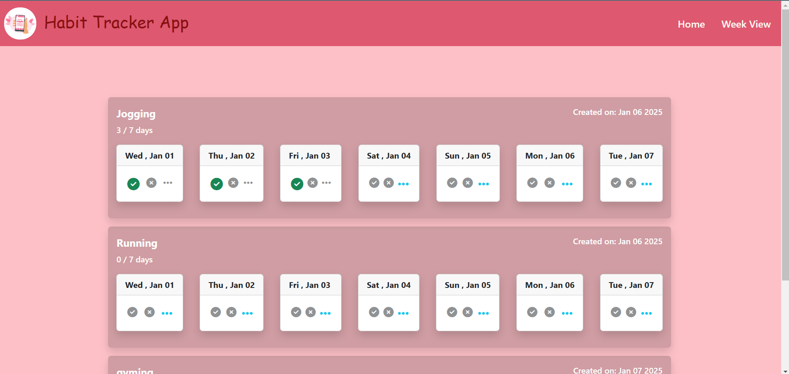

### Habit Tracker
A simple habit tracker application built by using NodeJS, ExpressJS, EJS, and MongoDB.This application allows users to add multiple habits and track them on daily basis.You can mark each habit as "Done," "Not Done," or "None" for each day.The application provides views to show all current habits, as well as a weekly view to display the status of 7 days of each habit.

## Features

- User can add multiple habits.
- Track multiple habits on a daily basis.
- Mark habits as "Done," "Not Done," or "None" for each day.
- View all current habits with an option to add new habits.
- Weekly view to display the status of each habit for the past 7 days.
- Ability to change the status of a habit for today or any of the previous 6 days

## Tech Stack

- NodeJS
- ExpressJS
- EJS
- MongoDB
- Mongoose

## Steps to Install and Run

- **Clone the repository:**
  - git clone https://github.com/devyani2995/Habit-Tacker-API-NodeJS.git
  - cd Habit-Tacker-API-NodeJS

- **Install dependencies:**
   npm install

- **Start the development server:**
   nodemon server.js
   
- Open your browser and navigate to http://localhost:5100 to view the app.

## Screenshots

- **Home Page**

- **Week View Page**

